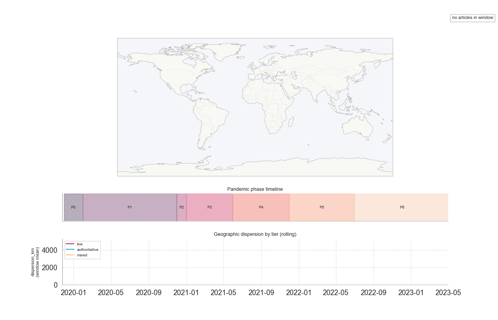

> Tracing COVID-era information spread



A pipeline that harvests archived COVID-related web pages (classified by source credibility) and analyses how each tier evolved along geographic and semantic space.
The animated KDE map above traces where the toponyms for each tier concentrated week by week across seven pandemic phases:

- **P0_outbreak** (Dec 2019 – Jan 2020)
- **P1_global onset** (Feb – Nov 2020)
- **P2_pre-vaccine** (Dec 2020)
- **P3_vaccine rollout** (Jan – May 2021)
- **P4_delta wave** (Jun – Nov 2021)
- **P5_omicron wave** (Dec 2021 – Jun 2022)
- **P6_transition end** (Jul 2022 – May 2023)
  The major milestones defining the phases are detailed with sources in [src/config.py](src/config.py)

> Does low-credibility content disperse, geographically and semantically, in ways that authoritative reporting does not?

## Data sources

Three Archive-It collections, chosen to give the hypothesis a comparative pair plus one generalisation probe.

| ID                                                | Name                                     | Tier      | Active seeds | Curator                                               | Role in the study                                                                                                                      |
| ------------------------------------------------- | ---------------------------------------- | --------- | -----------: | ----------------------------------------------------- | -------------------------------------------------------------------------------------------------------------------------------------- |
| [13559](https://archive-it.org/collections/13559) | False Coronavirus (COVID-19) Information | **low**   |           99 | NewsGuard Coronavirus Misinformation Tracking Center  | A tightly curated seed list of sites flagged as COVID-misinfo publishers.                                                              |
| [13529](https://archive-it.org/collections/13529) | Novel Coronavirus (COVID-19)             | **mixed** |       16,385 | International Internet Preservation Consortium (IIPC) | Mainstream/global COVID coverage (multilingual). The contrast set for 13559.                                                           |
| [4887](https://archive-it.org/collections/4887)   | Global Health Events                     | **mixed** |           34 | National Library of Medicine (U.S.)                   | Originally included to test generalisations beyond COVID (Ebola, Zika). **Dropped** from the primary analysis due to low active seeds. |

## Pipeline

```
            Archive-It CDX  ─►  harvest   ─►  raw captures
                                                  │
                                                  ▼
                                              normalize +
                                             trafilatura +
                                            fast-langdetect
                                                  │
                                    ┌─────────────┼─────────────┐
                                    ▼             ▼             ▼
                               embedings   georeferencing   EDA notebooks
                               (Qdrant)  (spaCy + GeoNames)
```

Five stages, each writing its own JSONL so steps are independently re-runnable:

| Stage            | Where                                                        | Output                                          |
| ---------------- | ------------------------------------------------------------ | ----------------------------------------------- |
| Harvest          | [scripts/harvest.py](scripts/harvest.py)                     | `data/raw/captures/{cid}/{phase}.jsonl`         |
| Normalize        | [scripts/run_normalize.py](scripts/run_normalize.py)         | `data/processed/normalized/{cid}/{phase}.jsonl` |
| Credibility      | [scripts/build_credibility.py](scripts/build_credibility.py) | `data/processed/credibility.json`               |
| Embed            | [scripts/embed.py](scripts/embed.py)                         | Qdrant collection per phase                     |
| **Georeference** | [scripts/georef.py](scripts/georef.py)                       | `data/processed/georef/{cid}/{phase}.jsonl`     |

## The georeferencing demo

Detects toponyms with spaCy's transformer NER `en_core_web_trf`, resolves them against a GeoNames `cities1000` gazetteer with **country-context boosting** + **population tie-break** disambiguation
Walkthrough lives in [notebooks/02_georeferencing_eda.ipynb](notebooks/02_georeferencing_eda.ipynb):

- coverage diagnostics
- top countries / cities per credibility tier
- country × phase log-mention heatmaps
- static atlas
- the animated map above
- hypothesis panel: _does low-credibility content spread geographically wider than authoritative reporting?_

## Quickstart

```powershell
# 1. Sync deps (uv) + spaCy transformer model + GeoNames gazetteer
uv sync
uv run python -m spacy download en_core_web_trf
uv run python -m georeferencing.setup_gazetteer

# 2. Harvest + normalize (one collection at a time; phase = all for the full sweep)
uv run python scripts/harvest.py 13559 all
uv run python scripts/run_normalize.py 13559 all
uv run python scripts/build_credibility.py

# 3. Georef
uv run python scripts/georef.py 13559 all
uv run python scripts/georef.py 4887 all

# 4. Explore
uv run jupyter lab notebooks/
```

> Every stage supports `--max-docs N` for a quick slice

## Project layout

```
src/
  ingest/          Archive-It CDX client + capture records
  normalize/       trafilatura HTML cache + main-text extraction
  credibility/     three-tier domain registry (low/authoritative/mixed)
  embed/           chonkie semantic chunking → Qdrant
  georeferencing/  spaCy NER + GeoNames gazetteer
  analysis/        cross-pipeline helpers
notebooks/
  01_normalized_eda.ipynb        corpus health, fetch quality, redundancy
  02_georeferencing_eda.ipynb    the geographic story
  animation_out/                 exported MP4 / GIF / HTML
data/                            JSONL artifacts
```

## Roadmap

### Semantic analysis (the original hypothesis)

- [ ] Per-tier semantic dispersion: cluster Qdrant embeddings per (tier, phase) and measure intra-cluster cohesion vs inter-cluster spread
- [ ] Topical entropy over time: track the distribution of semantic clusters
- [ ] Cross-tier nearest-neighbour analysis: measures how far misinformation drifts from the source consensus.

### Joining geography + semantics

- [ ] Correlate geographic and topical dispersion per article

### Knowledge graph

- [ ] Doc-doc edges from Qdrant similarity + co-mentioned-toponym edges weighted by time distance.
- [ ] Cross-tier propagation traces: detect chains where a narrative evolves across credibility tiers

### Coverage + corpus

- [ ] Multilingual NER pass (current pipeline is English-only).
- [ ] Augment the authoritative credibility registry with more non-English sources

## Status

Active prototype. Spun off as a demonstrator for the HEIG-VD internship _"Georeferencing of Texts Through Machine Learning"_ (Prof. J. Ingensand).
